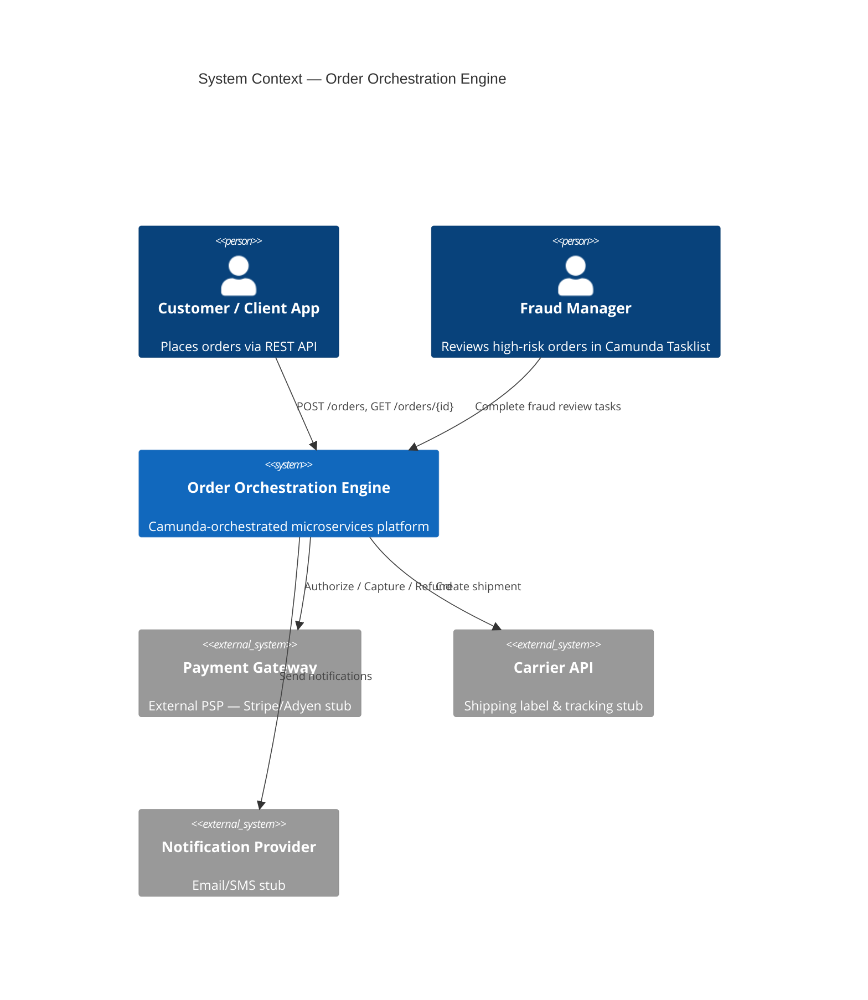
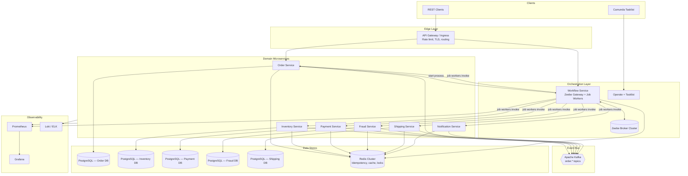
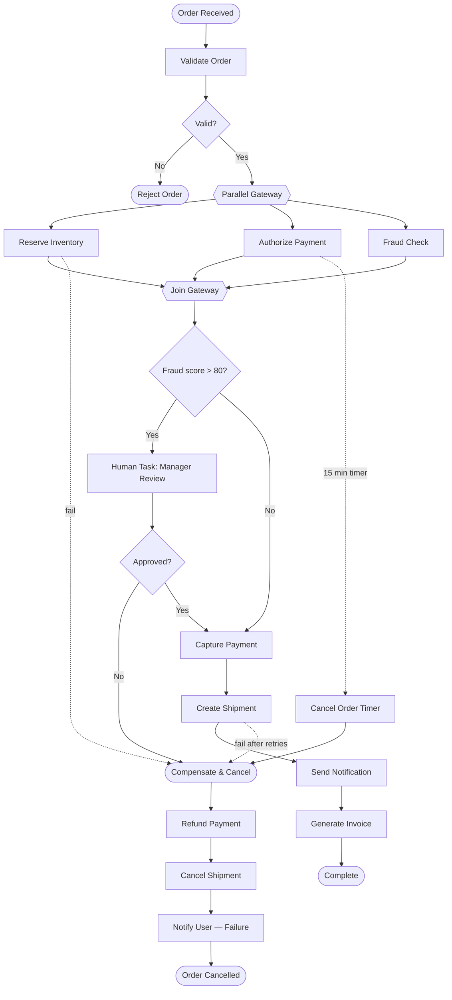
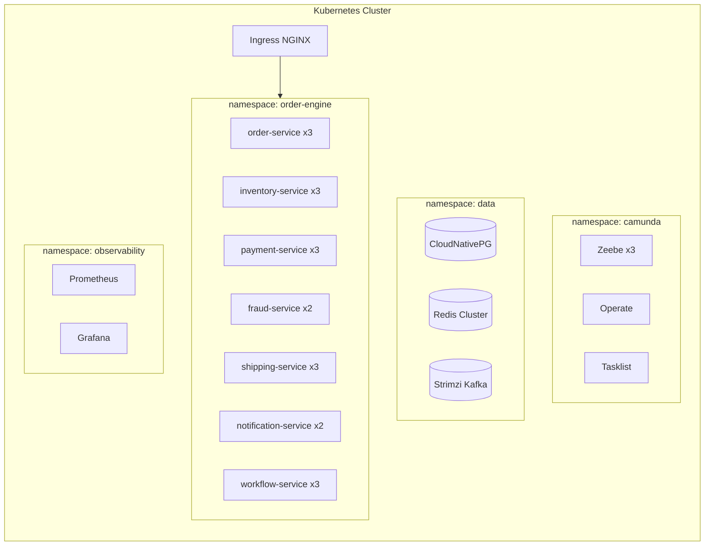

# Enterprise Order Orchestration Engine — High-Level Design (HLD)

| Field | Value |
|---|---|
| **Version** | 1.0.0 |
| **Status** | Draft |
| **Author** | Architecture Team |
| **Last Updated** | 2026-07-05 |

---

## 1. Executive Summary

The **Enterprise Order Orchestration Engine** is a distributed, event-driven order fulfillment platform that mirrors patterns used in telecom, banking, insurance, and logistics. Instead of a monolithic order processor, each business capability is implemented as an independent microservice. **Camunda 8 (Zeebe)** orchestrates the end-to-end workflow via BPMN, providing compensation (Saga), retries, human tasks, parallel execution, and timers.

This document describes the system at an architectural level: boundaries, data flows, non-functional requirements, and deployment topology. Detailed API contracts, BPMN element mappings, and schema definitions are in [LLD.md](./LLD.md).

---

## 2. Goals & Non-Goals

### 2.1 Goals

| # | Goal |
|---|---|
| G1 | Orchestrate multi-step order fulfillment with clear service boundaries |
| G2 | Support automatic compensation when downstream steps fail after prior steps succeed |
| G3 | Execute Inventory, Payment, and Fraud checks in parallel where safe |
| G4 | Pause workflow for human fraud review when score > 80 |
| G5 | Auto-cancel orders when payment is not completed within 15 minutes |
| G6 | Retry transient failures (e.g., shipping service down: 3 retries, 30s backoff) |
| G7 | Production-grade observability: structured logs, metrics, distributed tracing |
| G8 | Horizontally scalable stateless services; workflow state in Camunda + PostgreSQL |

### 2.2 Non-Goals (v1)

- Multi-region active-active deployment
- PCI-DSS certified payment vault (use tokenized mock/stub in personal project)
- Real carrier integrations (stub shipping provider)
- Customer-facing UI (API-only; fraud task via Camunda Tasklist)

---

## 3. Context Diagram



---

## 4. Logical Architecture



---

## 5. Microservice Responsibilities

| Service | Port | Responsibility | Owns Data |
|---|---|---|---|
| **Order Service** | 8081 | Order CRUD, validation rules, idempotency, publishes `order.created` | `orders`, `order_items`, `order_events` |
| **Inventory Service** | 8082 | Stock reservation, release, availability queries | `inventory`, `reservations` |
| **Payment Service** | 8083 | Authorize, capture, refund; payment timeout tracking | `payments`, `refunds` |
| **Fraud Service** | 8084 | Risk scoring, rules engine; triggers human review | `fraud_assessments`, `review_decisions` |
| **Shipping Service** | 8085 | Shipment creation, label generation, cancellation | `shipments` |
| **Notification Service** | 8086 | Email/SMS/push templated notifications | `notification_log` (outbox) |
| **Workflow Service** | 8080 | Zeebe process deployment, job workers, compensation handlers | None (orchestrator only; Camunda owns workflow state) |

> **Note:** Invoice generation is handled by Order Service (PDF/metadata) triggered by Workflow Service job worker, keeping service count aligned with the problem statement while avoiding an extra deployable for v1.

---

## 6. Order Fulfillment Workflow (BPMN Overview)



### 6.1 BPMN Advanced Features Mapping

| Feature | BPMN Element | Behavior |
|---|---|---|
| **Parallel Gateway** | `ParallelGateway` (fork/join) | Inventory, Payment auth, Fraud run concurrently; join waits for all |
| **Compensation** | `Event Subprocess` + `Compensation Tasks` | On failure after payment: refund → cancel shipment → notify |
| **Retry** | `Service Task` + `Retry Backoff` (job worker) | Shipping: 3 attempts, 30s exponential backoff |
| **Human Task** | `User Task` linked to Camunda Tasklist | Fraud score > 80 → assign to `fraud-managers` group |
| **Timer** | `Boundary Timer Event` on Payment | PT15M → escalate to cancel subprocess |

BPMN file: `workflow-service/src/main/resources/bpmn/order-fulfillment.bpmn` (see LLD).

---

## 7. Communication Patterns

### 7.1 Synchronous (Orchestration)

Camunda **job workers** in Workflow Service call domain services via **REST** (OpenAPI-generated clients). This keeps orchestration logic in BPMN and business logic in domain services.

```
Workflow Service (Job Worker) ──HTTP──▶ Inventory Service
                              ◀──JSON──
```

### 7.2 Asynchronous (Eventing)

Domain services publish domain events to Kafka for audit, analytics, and decoupled side effects.

| Topic | Producer | Consumers |
|---|---|---|
| `order.events` | Order Service | Notification (optional), audit pipeline |
| `inventory.events` | Inventory Service | Analytics |
| `payment.events` | Payment Service | Order Service (status sync), audit |
| `fraud.events` | Fraud Service | Audit |
| `shipping.events` | Shipping Service | Notification |
| `notification.events` | Notification Service | Audit |

### 7.3 Idempotency

All mutating APIs accept `Idempotency-Key` header. Keys are stored in **Redis** (TTL 24h) per service to guarantee exactly-once semantics at the application layer.

---

## 8. Data Architecture

### 8.1 Database-per-Service

Each microservice owns its PostgreSQL schema. **No cross-service DB joins.** Cross-service queries go through APIs or Kafka event projections.

### 8.2 Redis Usage

| Use Case | Key Pattern | TTL |
|---|---|---|
| Idempotency | `{service}:idempotency:{key}` | 24h |
| Inventory reservation lock | `inventory:lock:{sku}` | 5m |
| Fraud score cache | `fraud:score:{customerId}` | 1h |
| Rate limiting | `ratelimit:{clientId}:{endpoint}` | 1m |

### 8.3 Event Sourcing (Lightweight)

Order Service maintains an `order_events` append-only table for audit/replay. Not full event sourcing — operational state remains in `orders`.

---

## 9. Scalability & Resilience

### 9.1 Horizontal Scaling

| Component | Scaling Strategy |
|---|---|
| Domain microservices | Stateless pods; HPA on CPU + custom metric (request latency p95) |
| Workflow job workers | Scale on `zeebe_backlog` metric (pending jobs per job type) |
| Zeebe brokers | Partition-based; 3+ brokers for HA |
| Kafka | Partition by `orderId`; min 6 partitions for `order.events` |
| PostgreSQL | Primary + read replicas per service (v1: single instance acceptable locally) |
| Redis | Cluster mode (3 masters) in prod |

### 9.2 Failure Handling

| Failure | Response |
|---|---|
| Transient HTTP 5xx | Zeebe job retry with backoff |
| Permanent business failure (out of stock) | Trigger compensation subprocess |
| Broker partition loss | Zeebe replication factor 3 |
| Kafka consumer lag | Scale consumer group |
| Redis unavailable | Fail open for cache; fail closed for idempotency (503) |

### 9.3 Capacity Planning (Reference)

| Metric | Target (prod reference) |
|---|---|
| Orders/sec | 500 sustained, 2000 burst |
| p99 end-to-end latency | < 30s (excluding human task wait) |
| Availability | 99.9% (excluding planned maintenance) |

---

## 10. Security

| Layer | Control |
|---|---|
| Transport | TLS 1.3 everywhere (mTLS service-to-service in prod) |
| Authentication | OAuth2 JWT (Keycloak) for external clients; service accounts internally |
| Authorization | RBAC: `order:write`, `fraud:review`, etc. |
| Secrets | Vault / K8s Secrets; never in repo |
| PII | Mask in logs via logback patterns; encrypt at rest |
| API | Rate limiting at gateway (100 req/min/client default) |

---

## 11. Observability

### 11.1 Three Pillars

| Pillar | Tool | Details |
|---|---|---|
| **Logs** | Logback → Loki/ELK | Structured JSON; per-service `logback-spring.xml` (see LLD §12) |
| **Metrics** | Micrometer → Prometheus | RED metrics per endpoint; custom business counters |
| **Traces** | OpenTelemetry → Tempo/Jaeger | W3C `traceparent` propagated across services |

### 11.2 Key Dashboards (Grafana)

- Order throughput & success rate
- Workflow instance duration by stage
- Compensation trigger rate
- Fraud human task queue depth
- Kafka consumer lag
- Service SLA (p50/p95/p99 latency)

### 11.3 Alerting

| Alert | Condition |
|---|---|
| High order failure rate | `order_failure_rate > 5%` for 5m |
| Payment timeout spike | `payment_timeout_total` anomaly |
| Zeebe backlog | `pending_jobs > 1000` for 10m |
| Shipping retry exhaustion | `shipping_retry_exhausted_total > 0` |

---

## 12. Deployment Topology

### 12.1 Local (Docker Compose)

```
┌─────────────────────────────────────────────────────────┐
│  docker-compose.yml                                      │
│  ├── postgres (6 schemas via init scripts)              │
│  ├── redis                                               │
│  ├── kafka + zookeeper (or KRaft)                       │
│  ├── camunda (Zeebe + Operate + Tasklist + Elasticsearch)│
│  ├── prometheus + grafana                               │
│  └── 7 Spring Boot services                             │
└─────────────────────────────────────────────────────────┘
```

### 12.2 Production (Kubernetes)



### 12.3 CI/CD Pipeline

```
Push → Build (Maven) → Unit Tests → Integration Tests (Testcontainers)
     → Container Scan (Trivy) → Push to Registry → Deploy to Staging
     → Contract Tests (Pact) → Deploy to Prod (ArgoCD, blue/green)
```

---

## 13. Technology Stack Summary

| Layer | Technology | Version |
|---|---|---|
| Language | Java | 21 |
| Framework | Spring Boot | 3.3.x |
| Orchestration | Camunda 8 (Zeebe) | 8.5.x |
| Messaging | Apache Kafka | 3.7.x |
| RDBMS | PostgreSQL | 16 |
| Cache | Redis | 7.x |
| API Docs | SpringDoc OpenAPI | 2.x |
| Metrics | Micrometer + Prometheus | — |
| Dashboards | Grafana | 10.x |
| Containers | Docker | 24.x |
| Orchestration (prod) | Kubernetes | 1.29+ |

---

## 14. Service URL Map (Runtime)

Base URL pattern: `https://{env}.order-engine.example.com`

| Service | Base Path | Health | OpenAPI |
|---|---|---|---|
| Workflow Service | `/workflow` | `/workflow/actuator/health` | `/workflow/v3/api-docs` |
| Order Service | `/orders` | `/orders/actuator/health` | `/orders/v3/api-docs` |
| Inventory Service | `/inventory` | `/inventory/actuator/health` | `/inventory/v3/api-docs` |
| Payment Service | `/payments` | `/payments/actuator/health` | `/payments/v3/api-docs` |
| Fraud Service | `/fraud` | `/fraud/actuator/health` | `/fraud/v3/api-docs` |
| Shipping Service | `/shipping` | `/shipping/actuator/health` | `/shipping/v3/api-docs` |
| Notification Service | `/notifications` | `/notifications/actuator/health` | `/notifications/v3/api-docs` |

Local defaults: `http://localhost:{port}` — see [LLD.md §3](./LLD.md#3-microservice-api-catalog).

---

## 15. Risks & Mitigations

| Risk | Impact | Mitigation |
|---|---|---|
| Camunda 8 operational complexity | High | Docker Compose profile for local; managed Camunda SaaS option for prod |
| Distributed transaction inconsistency | High | BPMN compensation + idempotent APIs |
| Kafka ordering across partitions | Medium | Partition key = `orderId` |
| Human task SLA breach | Medium | Escalation timer on user task (24h → auto-reject) |
| Log volume cost | Medium | Sampling for debug; INFO default in prod |

---

## 16. Document References

| Document | Path |
|---|---|
| Low-Level Design | [docs/LLD.md](./LLD.md) |
| BPMN Diagram | `workflow-service/src/main/resources/bpmn/order-fulfillment.bpmn` |
| OpenAPI Specs | `{service}/src/main/resources/openapi/` |
| Log Configs | `{service}/src/main/resources/logback-spring.xml` |
| Docker Compose | `deploy/docker-compose.yml` |

---

## 17. Glossary

| Term | Definition |
|---|---|
| **Saga** | Sequence of local transactions with compensating actions |
| **Job Worker** | Spring component polling Zeebe for service tasks |
| **Compensation** | Undo previously completed steps (refund, release inventory) |
| **Idempotency Key** | Client-supplied key ensuring duplicate requests produce same result |
