 # Implementation Phases — Enterprise Order Orchestration Engine

| Field | Value |
|---|---|
| **Version** | 1.0.0 |
| **Camunda** | 8 (Zeebe) |
| **Java** | 21 |
| **Spring Boot** | 4.1.0 |
| **Related docs** | [HLD](./HLD.md) · [LLD](./LLD.md) · [IMPLEMENTATION-PATTERNS](./IMPLEMENTATION-PATTERNS.md) |
| **Last Updated** | 2026-07-07 |

---

## How to use this document

1. Complete phases **in order** — later phases depend on earlier ones.
2. Do **not** start the next phase until **all exit criteria** for the current phase are checked.
3. Each step has a checkbox `[ ]` — tick as you go during development.
4. **One step per change** — implement, verify, then proceed. Never scaffold an entire phase in one commit.
5. **Verification** sections describe how to prove the step is done.
6. Phases map to HLD goals (G1–G8) and LLD sections.

```mermaid
flowchart LR
    P0[Phase 0\nScaffold] --> P1[Phase 1\nInfra]
    P1 --> P2[Phase 2\nShared]
    P2 --> P3[Phase 3\nOrder Svc]
    P3 --> P4[Phase 4\nDomain Svcs]
    P4 --> P5[Phase 5\nClients]
    P5 --> P6[Phase 6\nOrchestration Core]
    P6 --> P7[Phase 7\nHappy Path BPMN]
    P7 --> P8[Phase 8\nAdvanced BPMN]
    P8 --> P9[Phase 9\nCompensation]
    P9 --> P10[Phase 10\nEvents & Observability]
    P10 --> P11[Phase 11\nE2E & Demo]
```



---

## Phase overview

| Phase | Name | HLD goals | Est. effort |
|---|---|---|---|
| 0 | Project scaffold | — | 1–2 days |
| 1 | Local infrastructure | G8 | 1–2 days |
| 2 | Shared libraries & conventions | G7 | 1–2 days |
| 3 | Order Service | G1 | 2–3 days |
| 4 | Domain microservices | G1 | 4–6 days |
| 5 | Channel clients (OpenAPI) | — | 2 days |
| 6 | Orchestration app core | G1 | 2–3 days |
| 7 | Happy-path BPMN + workers | G1, G3 | 3–4 days |
| 8 | Advanced BPMN features | G4, G5, G6 | 3–4 days |
| 9 | Compensation chain | G2 | 2–3 days |
| 10 | Kafka, metrics, Grafana | G7 | 2–3 days |
| 11 | Integration tests & demo | G1–G8 | 2–3 days |

---

## Phase 0 — Project scaffold

### Objective

Create the Maven multi-module skeleton and repository layout so all subsequent work has a consistent home.

### Exit criteria

- [x] Parent POM builds with `mvn clean install -DskipTests`
- [x] Module structure matches [IMPLEMENTATION-PATTERNS §3.1](./IMPLEMENTATION-PATTERNS.md#31-module-layout)
- [x] `.gitignore` covers `target/`, `.env`, IDE files
- [x] `README.md` links to HLD, LLD, phases, patterns docs

> **Workflow rule:** Complete **one numbered step at a time**. Verify before moving on. Do not batch entire phases in a single change.

### Steps (one micro-step per change — stop and verify after each)

#### 0.1 Root parent POM only

- [x] **0.1.1** Create root `pom.xml` with `packaging=pom`, Java 21, Spring Boot **4.1.0** parent — **no modules yet**
- [x] **0.1.2** Verify: `mvn -f pom.xml validate` → SUCCESS

#### 0.2 Add `order-common` module only

- [x] **0.2.1** Add `<module>order-common</module>` to root POM
- [x] **0.2.2** Create `order-common/pom.xml` (jar, depends on `spring-boot-starter` only)
- [x] **0.2.3** Create `OrderEngineConstants.java` placeholder
- [x] **0.2.4** Verify: `mvn clean install -DskipTests` → SUCCESS (2 modules)

#### 0.3 Add `.gitignore`

- [x] **0.3.1** Create root `.gitignore` (`target/`, `.env`, IDE files)
- [x] **0.3.2** Verify: file exists, no build impact

#### 0.4 Add `order-service` only (template for others)

- [x] **0.4.1** Add `<module>order-service</module>` to root POM
- [x] **0.4.2** Create `order-service/pom.xml` (web + actuator + order-common)
- [x] **0.4.3** Create `OrderServiceApplication.java`
- [x] **0.4.4** Create `application.yml` (port 8081, context `/orders`)
- [x] **0.4.5** Create `logback-spring.xml`
- [x] **0.4.6** Create `HealthProbeController` in `controller/` package → `GET /v1/health`
- [x] **0.4.7** Verify: `mvn clean install -DskipTests` then `mvn spring-boot:run -pl order-service` → curl health OK

#### 0.5 Repeat 0.4 for each remaining domain service (one service per session)

- [x] **0.5.1** `inventory-service` (8082, `/inventory`) — verify alone
- [x] **0.5.2** `payment-service` (8083, `/payments`) — verify alone
- [x] **0.5.3** `fraud-service` (8084, `/fraud`) — verify alone
- [x] **0.5.4** `shipping-service` (8085, `/shipping`) — verify alone
- [x] **0.5.5** `notification-service` (8086, `/notifications`) — verify alone

#### 0.6 Add `order-orchestration-app` only

- [x] **0.6.1** Add module to root POM
- [x] **0.6.2** Create pom + Application + yml (8090, `/orchestration`) + health — verify alone

#### 0.7 Add `channel` aggregator + one client (`order-client`)

- [x] **0.7.1** Create `channel/pom.xml` aggregator, add `<module>channel</module>` to root
- [x] **0.7.2** Create `channel/order-client` stub — verify build

#### 0.8 Add remaining channel clients (one at a time)

- [x] **0.8.1** `inventory-client`
- [x] **0.8.2** `payment-client`
- [x] **0.8.3** `fraud-client`
- [x] **0.8.4** `shipping-client`
- [x] **0.8.5** `notification-client`
- [x] **0.8.6** Verify: full `mvn clean install -DskipTests`

#### 0.9 Deploy folder stubs (one file at a time)

- [x] **0.9.1** `deploy/docker-compose.yml` (empty stub)
- [x] **0.9.2** `deploy/README.md` (planned ports)
- [x] **0.9.3** `deploy/bpmn/` directory
- [x] **0.9.4** `deploy/prometheus/prometheus.yml` stub
- [x] **0.9.5** `deploy/grafana/dashboards/` directory

#### 0.10 Root README

- [x] **0.10.1** Create `README.md` linking to docs — Phase 0 complete

### Verification (full phase — only after 0.10)

```bash
mvn clean install -DskipTests
# Expected: BUILD SUCCESS for all modules
```

---

## Phase 1 — Local infrastructure (Docker Compose)

### Objective

All external dependencies run locally with one command. Camunda 8 (Zeebe + Operate + Tasklist) is reachable.

### Exit criteria

- [ ] `docker compose up -d` starts all infra without errors
- [ ] Zeebe gateway reachable at `localhost:26500`
- [ ] Operate UI at `http://localhost:8088` (or documented port)
- [ ] Tasklist UI reachable for human tasks
- [ ] PostgreSQL: 6 databases/schemas (one per domain service)
- [ ] Redis, Kafka, Prometheus, Grafana running
- [ ] Health documented in `deploy/README.md`

### Steps

#### 1.1 PostgreSQL

- [x] Single Postgres container with init scripts:
  - `order_db`, `inventory_db`, `payment_db`, `fraud_db`, `shipping_db`, `notification_db`
- [ ] Flyway/Liquibase placeholder per service (enabled in Phase 3+)

#### 1.2 Redis

- [x] Redis 7 on `localhost:6379`

#### 1.3 Kafka

- [ ] Kafka (KRaft or Zookeeper) on `localhost:9092`
- [ ] Pre-create topics from [LLD §6.1](./LLD.md#61-topic-configuration) (or auto-create enabled)

#### 1.4 Camunda 8

- [ ] Use official Camunda 8 Docker Compose (or slim self-managed stack):
  - Zeebe broker
  - Operate
  - Tasklist
  - Elasticsearch (if required by stack)
- [ ] Document ports in `deploy/README.md`
- [ ] Verify `zbctl status` or Operate shows healthy cluster

#### 1.5 Observability (infra only)

- [ ] Prometheus scraping config stub
- [ ] Grafana with Prometheus datasource provisioned

#### 1.6 Docker Compose for apps (stub)

- [ ] Commented-out service blocks for Spring Boot apps (enabled as each phase completes)

### Verification

```bash
cd deploy && docker compose up -d
# Zeebe
zbctl status --address localhost:26500
# Postgres
psql -h localhost -U postgres -l
# Redis
redis-cli ping   # → PONG
# Kafka
kafka-topics.sh --list --bootstrap-server localhost:9092
```

---

## Phase 2 — Shared libraries & conventions

### Objective

Cross-cutting concerns live in `order-common` and are reused by every service. Logging and API conventions are consistent from day one.

### Exit criteria

- [ ] `order-common` published to local Maven repo
- [x] Standard error response matches [LLD §2.2](./LLD.md#22-standard-error-response)
- [x] `ApiAccessLogFilter` logs `API IN` / `API OUT` with correlation ID
- [ ] `IdempotencyFilter` skeleton (Redis-backed, used in Phase 3+)
- [ ] `logback-spring.xml` template copied to every module
- [ ] `HandlerActivityName` and `ActivityParameters` constants in `order-common` (or orchestration module)

### Steps

#### 2.1 order-common — errors & DTOs

- [x] `ApiErrorResponse`, `ErrorCode` enum
- [x] `CorrelationIdFilter` — reads/generates `X-Correlation-Id`, sets MDC
- [x] `ApiAccessLogFilter` — method, path, status, durationMs, orderId (if present)

#### 2.2 order-common — idempotency

- [ ] `IdempotencyFilter` — `Idempotency-Key` header, Redis `SET NX` with TTL 24h
- [ ] `IdempotencyConfig` — Redis connection from env

#### 2.3 Logging template

- [ ] Create canonical `logback-spring.xml` per [LLD §12](./LLD.md#12-logging-configuration-logback-springxml)
- [ ] Copy to each service; set `APP_NAME` / logger package per service

#### 2.4 Orchestration constants

- [ ] `HandlerActivityName.java` — all activity names from [IMPLEMENTATION-PATTERNS §4](./IMPLEMENTATION-PATTERNS.md#4-granular-activity-catalog)
- [ ] `ActivityParameters.java` — process variable keys from [IMPLEMENTATION-PATTERNS §5](./IMPLEMENTATION-PATTERNS.md#5-process-variables-activityparameters)

#### 2.5 Trace propagation stub

- [ ] Add `micrometer-tracing` dependency to parent POM
- [ ] `traceparent` propagation in `RestClient`/`WebClient` builder utility

### Verification

- [ ] Small `@SpringBootTest` in `order-common` proves filters set MDC correctly
- [ ] Sample log line contains `correlationId`, `service`, `httpPath`

---

## Phase 3 — Order Service

### Objective

First domain microservice is production-shaped: REST APIs, DB schema, idempotency, logging, OpenAPI.

### Exit criteria

- [ ] All Order Service **input APIs** from [LLD §3.1](./LLD.md#31-order-service) implemented
- [ ] PostgreSQL schema from [LLD §5.1](./LLD.md#51-order-service--order_db) applied
- [ ] `POST /v1/orders` creates order in `CREATED` status (does **not** start workflow yet — Phase 6)
- [ ] `GET`, `PATCH /status`, `POST /validate`, `POST /invoice` work
- [ ] OpenAPI at `/orders/v3/api-docs`
- [ ] Actuator health + prometheus at `/orders/actuator/prometheus`
- [ ] Postman/curl smoke test documented

### Steps

#### 3.1 Persistence

- [ ] Flyway migration `V1__create_orders.sql` per LLD §5.1
- [ ] JPA entities: `Order`, `OrderItem`, `OrderEvent`, `Invoice`
- [ ] Repositories + `OrderService` / `OrderServiceImpl`

#### 3.2 REST controllers

- [ ] `OrderController` — `POST /v1/orders`, `GET /v1/orders/{id}`, `GET /v1/orders`
- [ ] `OrderValidationController` — `POST /v1/orders/{id}/validate`
- [ ] `OrderInvoiceController` — `POST /v1/orders/{id}/invoice`
- [ ] `OrderStatusController` — `PATCH /v1/orders/{id}/status`

#### 3.3 Business rules

- [ ] Validation: non-empty items, positive quantity, valid address fields
- [ ] Status transitions enforced (state machine from [LLD §2.3](./LLD.md#23-order-status-state-machine))
- [ ] `order_events` append-only audit on every status change

#### 3.4 Cross-cutting

- [ ] Wire `order-common` filters
- [ ] `logback-spring.xml` for `order-service`
- [ ] `application.yml`: port `8081`, context-path `/orders`, Postgres URL

#### 3.5 OpenAPI

- [ ] SpringDoc dependency; annotate controllers
- [ ] Export spec to `order-service/src/main/resources/openapi/order-api.yaml`

### Verification

```bash
# Create order
curl -X POST http://localhost:8081/orders/v1/orders \
  -H "Content-Type: application/json" \
  -H "Idempotency-Key: $(uuidgen)" \
  -d '{"customerId":"cust-001","items":[{"sku":"SKU-123","quantity":2,"unitPrice":29.99}],"shippingAddress":{"line1":"123 Main St","city":"Seattle","state":"WA","postalCode":"98101","country":"US"},"currency":"USD"}'

# Get order → status CREATED
# Validate → valid=true
# Patch status → VALIDATED
```

---

## Phase 4 — Domain microservices

### Objective

Remaining five services implemented with the same patterns as Order Service. Each is independently testable.

### Exit criteria

| Service | Port | LLD section | Schema | Core APIs working |
|---|---|---|---|---|
| Inventory | 8082 | §3.2, §5.2 | Yes | reserve, release, confirm, stock |
| Payment | 8083 | §3.3, §5.3 | Yes | authorize, capture, refund, void |
| Fraud | 8084 | §3.4, §5.4 | Yes | assess, decision, get |
| Shipping | 8085 | §3.5, §5.5 | Yes | create, cancel, tracking |
| Notification | 8086 | §3.6, §5.6 | Yes | send, status |

- [ ] Each service has Flyway migrations, OpenAPI, logback, actuator
- [ ] Payment uses **stub** payment gateway (in-process or WireMock)
- [ ] Shipping uses **stub** carrier
- [ ] Notification uses **stub** email provider (log-only acceptable)
- [ ] Fraud scoring: configurable rule (e.g. new account + high value → score > 80)

### Steps

#### 4.1 Inventory Service

- [ ] Schema `V1__inventory.sql`
- [ ] Seed data: `SKU-123` with quantity 150
- [ ] `POST /v1/reservations` — pessimistic lock via Redis `inventory:lock:{sku}`
- [ ] `DELETE /v1/reservations/{id}` — idempotent release
- [ ] `POST /v1/reservations/{id}/confirm`
- [ ] `GET /v1/inventory/{sku}`

#### 4.2 Payment Service

- [ ] Schema `V1__payments.sql`
- [ ] `POST /v1/payments/authorize` → status `AUTHORIZED`
- [ ] `POST /v1/payments/{id}/capture` → `CAPTURED`
- [ ] `POST /v1/payments/{id}/refund` → `REFUNDED`
- [ ] `POST /v1/payments/{id}/void` (for compensation — authorized-only)
- [ ] Stub gateway bean

#### 4.3 Fraud Service

- [ ] Schema `V1__fraud.sql`
- [ ] `POST /v1/assessments` — returns `score`, `requiresReview` (true if score > 80)
- [ ] `POST /v1/assessments/{id}/decision` — `APPROVED` / `REJECTED`
- [ ] `GET /v1/assessments/{id}`

#### 4.4 Shipping Service

- [ ] Schema `V1__shipping.sql`
- [ ] `POST /v1/shipments` — returns `trackingNumber`, `labelUrl`
- [ ] `DELETE /v1/shipments/{id}` — cancel (idempotent)
- [ ] Optional: configurable stub failure mode for retry testing (Phase 8)

#### 4.5 Notification Service

- [ ] Schema `V1__notifications.sql`
- [ ] `POST /v1/notifications/send` → `202 QUEUED`
- [ ] Templates: `ORDER_SHIPPED`, `ORDER_CANCELLED`
- [ ] `GET /v1/notifications/{id}`

#### 4.6 Per-service verification

- [ ] Curl smoke test per service documented in `docs/verification/phase-4-smoke-tests.md`

### Verification

- [ ] Reserve inventory for a test orderId → `201`
- [ ] Authorize + capture payment → statuses correct
- [ ] Fraud assess with high-value new customer → `requiresReview=true`
- [ ] Create shipment → tracking number returned
- [ ] Send notification → `QUEUED`

---

## Phase 5 — Channel clients (OpenAPI)

### Objective

Type-safe REST clients for `order-orchestration-app` to call domain services. Matches std-services `channel/*-client` pattern.

### Exit criteria

- [ ] OpenAPI spec per domain service exported and committed under `channel/*/src/main/resources/openapi/`
- [ ] `openapi-generator-maven-plugin` generates `*Api` interfaces
- [ ] Thin `@Component` client wrappers per service with error checking
- [ ] `@ConfigurationProperties` config beans with `base-url` per [LLD §14](./LLD.md#14-configuration-properties)
- [ ] `mvn clean install` generates and compiles all clients

### Steps

#### 5.1 Codegen setup

- [ ] Parent POM plugin config: `generatorName=spring`, `library=spring-boot`, `useSpringBoot4=true`
- [ ] One client module per domain service

#### 5.2 Client wrappers

- [ ] `OrderServiceClient`, `InventoryServiceClient`, `PaymentServiceClient`, etc.
- [ ] Each wraps generated API; throws `DomainServiceException` on 4xx/5xx
- [ ] Propagate `X-Correlation-Id` and `traceparent` on every call

#### 5.3 Local config defaults

```yaml
com.orderengine.client.order.base-url: http://localhost:8081/orders
# ... inventory, payment, fraud, shipping, notification
```

### Verification

- [ ] Integration test: client calls running Order Service → `200`
- [ ] Generated code compiles without manual edits

---

## Phase 6 — Orchestration app core

### Objective

`order-orchestration-app` connects to Zeebe and runs job workers using the std-services layering adapted for Camunda 8.

### Exit criteria

- [ ] Zeebe client connected (`zeebe.client.broker.gateway-address`)
- [ ] `AbstractJobWorker` base class (equivalent to `AbstractActivityProcessor`)
- [ ] Job logging: `JOB IN` / `JOB OUT` with `activity`, `orderId`, `durationMs`
- [ ] `POST /v1/processes/order-fulfillment/start` starts process instance
- [ ] `GET /v1/instances/{key}` returns instance status
- [ ] BPMN `process_order_fulfillment.bpmn` deployed (skeleton: start → end)
- [ ] One sample worker `GetOrderForFulfillment` end-to-end
- [ ] Order Service updated: `POST /v1/orders` triggers workflow start

### Steps

#### 6.1 Zeebe / Spring integration

- [ ] Add `spring-boot-starter-camunda` (Camunda 8 Spring SDK) or `zeebe-client-spring`
- [ ] `application.yml`: gateway address, job timeouts, poll interval
- [ ] `ZeebeDeploymentConfig` — deploy BPMN from `classpath:bpmn/` on startup

#### 6.2 Abstract worker pattern

- [ ] `AbstractJobWorker` — read variables, execute logic, complete/fail job
- [ ] `JobWorkerLogger` — MDC setup from `ActivatedJob` (processInstanceKey, orderId)
- [ ] `JobWorkerExceptionHandler` — map exceptions to `fail()` vs `throwError()` (BPMN error)

#### 6.3 Process start API

- [ ] `WorkflowController` — start process with variables: `orderId`, `customerId`, `totalAmount`, etc.
- [ ] `OrderService` calls orchestration app after order creation
- [ ] Store `workflowInstanceKey` on order record

#### 6.4 First worker

- [ ] `GetOrderForFulfillmentWorker` — `@JobWorker(type = "GetOrderForFulfillment")`
- [ ] Calls `OrderServiceClient.getOrder(orderId)`
- [ ] Completes job with `order` variable (thin JSON or orderId only — prefer thin)

#### 6.5 Skeleton BPMN

- [ ] `deploy/bpmn/process_order_fulfillment-1.0.bpmn`:
  - Start → `GetOrderForFulfillment` (serviceTask) → End
- [ ] `zeebe:taskDefinition type="GetOrderForFulfillment"`

### Verification

```bash
# Create order → workflow starts
curl -X POST http://localhost:8081/orders/v1/orders ...
# Check Operate → process instance ACTIVE → COMPLETED
# Logs show JOB IN/OUT for GetOrderForFulfillment
```

---

## Phase 7 — Happy-path BPMN + workers

### Objective

Full successful order flow without fraud review, failures, or compensation. Implements validation → parallel fork → capture → ship → notify → invoice → complete.

### Exit criteria (maps to HLD G1, G3)

- [ ] All workers for §4.1–§4.5 in [IMPLEMENTATION-PATTERNS](./IMPLEMENTATION-PATTERNS.md) implemented (except fraud review branch — always low score in test)
- [ ] BPMN includes: validation gateway, parallel gateway (inventory + payment + fraud), join, capture, ship, notify, invoice, complete
- [ ] End-to-end: `POST /orders` → order status `COMPLETED` within test profile
- [ ] Operate screenshot-worthy BPMN diagram saved to `docs/images/`

### Steps

#### 7.1 Validation workers (§4.1)

- [ ] `ValidateOrderItemsWorker`
- [ ] `ValidateShippingAddressWorker`
- [ ] `UpdateOrderStatusToValidatedWorker`
- [ ] `UpdateOrderStatusToRejectedWorker` (dead-end path to cancelled end event)
- [ ] BPMN: `Gateway_ValidationResult` on `validItems && validAddress`

#### 7.2 Build / transform workers (local only — no HTTP)

- [ ] `BuildReserveInventoryRequestWorker`
- [ ] `BuildAuthorizePaymentRequestWorker`
- [ ] `BuildFraudAssessmentRequestWorker`
- [ ] `BuildCreateShipmentRequestWorker`
- [ ] `BuildOrderShippedNotificationRequestWorker`
- [ ] Extract workers: `ExtractReservationId`, `ExtractPaymentId`, `ExtractFraudScore`, `ExtractShipmentId`

#### 7.3 Domain call workers (§4.2–§4.5)

- [ ] `ReserveInventoryInInventoryServiceWorker`
- [ ] `AuthorizePaymentInPaymentServiceWorker`
- [ ] `AssessFraudInFraudServiceWorker`
- [ ] `CapturePaymentInPaymentServiceWorker`
- [ ] `UpdateOrderStatusToPaidWorker`
- [ ] `CreateShipmentInShippingServiceWorker`
- [ ] `UpdateOrderStatusToShippedWorker`
- [ ] `SendOrderShippedNotificationWorker`
- [ ] `GenerateInvoiceInOrderServiceWorker`
- [ ] `UpdateOrderStatusToCompletedWorker`

#### 7.4 BPMN modeling

- [ ] Model in Camunda Modeler — one `serviceTask` per worker
- [ ] Each task: `zeebe:taskDefinition type="<WorkerName>"` + `zeebe:ioMapping`
- [ ] Parallel gateway fork + join for inventory / payment / fraud branches
- [ ] Deploy updated BPMN; version bump in filename `process_order_fulfillment-1.1.bpmn`

#### 7.5 Service layer per worker

- [ ] Each worker delegates to `*Service` → `*Client` (std-services layering)
- [ ] No business logic hidden in workers — only variable mapping + service call

### Verification

| Step | Check |
|---|---|
| Create order (low fraud risk customer) | `COMPLETED` |
| Inventory | `reservation` status `CONFIRMED` or released after flow |
| Payment | `CAPTURED` |
| Shipment | `trackingNumber` present |
| Notification | `SENT` or `QUEUED` |
| Invoice | `invoiceId` on order |
| Operate | Full path green for one instance |

---

## Phase 8 — Advanced BPMN features

### Objective

Human task, payment timer, and shipping retry. Maps to HLD G4, G5, G6.

### Exit criteria

- [ ] **G4** Fraud score > 80 → workflow pauses → Tasklist task → approve → continues
- [ ] **G5** Payment not captured within 15 min → auto-cancel path triggered
- [ ] **G6** Shipping fails 2× then succeeds on 3rd retry (or fail after 3 → compensation in Phase 9)
- [ ] Fraud reject path → routes to compensation entry (Phase 9 gateway stub OK)

### Steps

#### 8.1 Fraud human task (§4.3)

- [ ] BPMN `userTask` `FraudManagerReview` — candidate group `fraud-managers`
- [ ] `UpdateOrderStatusToFraudReviewWorker`
- [ ] `RecordFraudReviewDecisionWorker` — reads `fraudDecision` from task completion
- [ ] `Gateway_FraudReviewRequired` — `${requiresFraudReview == true}`
- [ ] `Gateway_FraudApproved` — `${fraudDecision == "APPROVED"}`
- [ ] Configure Tasklist connection; document login/group setup in `deploy/README.md`

#### 8.2 Payment timeout timer (§4.6)

- [ ] Boundary timer `PT15M` on `AuthorizePaymentInPaymentService` task
- [ ] `UpdateOrderStatusToPaymentTimeoutWorker`
- [ ] Timer flow connects to `Gateway_CompensationEntry` (compensation workers in Phase 9)

#### 8.3 Shipping retry (§4.6 / LLD §9)

- [ ] `zeebe:taskDefinition retries="3"` on `CreateShipmentInShippingService`
- [ ] `zeebe:header key="retryBackoff" value="PT30S"`
- [ ] Shipping stub: `failFirstNCalls=2` toggle for tests
- [ ] Worker throws retriable error on transient failure; BPMN error on exhaustion

### Verification

| Scenario | Expected |
|---|---|
| High-risk customer (fraud score 85) | Task appears in Tasklist; approve → COMPLETED |
| Same, but reject | Routes toward compensation (Phase 9) |
| Payment timer | Use `PT1M` in test profile; order → PAYMENT_TIMEOUT |
| Shipping retry | Logs show 3 attempts; success on 3rd |

---

## Phase 9 — Compensation chain

### Objective

When a step fails after prior steps succeeded, the saga rolls back cleanly. Maps to HLD G2.

### Exit criteria

- [ ] Compensation workers §4.7 all implemented
- [ ] Scenario: payment captured + shipping fails (after retries) → refund + release inventory + notify + `CANCELLED`
- [ ] Scenario: fraud rejected → void auth + release inventory
- [ ] Scenario: payment timeout → void + release
- [ ] Each compensation step is **idempotent** (safe to retry)
- [ ] `compensationReason` variable set on entry

### Steps

#### 9.1 Compensation workers (§4.7)

- [ ] `VoidPaymentInPaymentServiceWorker`
- [ ] `RefundPaymentInPaymentServiceWorker`
- [ ] `CancelShipmentInShippingServiceWorker` (no-op if no shipmentId)
- [ ] `ReleaseInventoryInInventoryServiceWorker`
- [ ] `BuildOrderCancelledNotificationRequestWorker`
- [ ] `SendOrderCancelledNotificationWorker`
- [ ] `UpdateOrderStatusToCancelledWorker`

#### 9.2 BPMN compensation flow

- [ ] `Gateway_CompensationEntry` — merge timer, fraud reject, shipping fail
- [ ] `Gateway_PaymentCompensationType` — `CAPTURED` → refund; `AUTHORIZED` only → void
- [ ] End event `OrderCancelled`
- [ ] Error boundary on `CreateShipmentInShippingService` → compensation

#### 9.3 Idempotent undo

- [ ] Payment: skip refund if already `REFUNDED`
- [ ] Inventory: skip release if already `RELEASED`
- [ ] Shipping: skip cancel if already `CANCELLED`

### Verification

| Scenario | Expected final status |
|---|---|
| Shipping exhausted retries | `CANCELLED`, payment `REFUNDED`, inventory released |
| Fraud rejected | `CANCELLED`, payment voided |
| Payment timeout | `CANCELLED`, inventory released |
| Customer notification | `ORDER_CANCELLED` template sent |

---

## Phase 10 — Kafka events & observability

### Objective

Event-driven audit trail and production-grade visibility. Maps to HLD G7.

### Exit criteria

- [ ] All services publish to Kafka topics per [LLD §6](./LLD.md#6-kafka-event-schemas)
- [ ] Event envelope includes `eventId`, `correlationId`, `orderId`
- [ ] Prometheus metrics exposed on all services
- [ ] Grafana dashboard: order throughput, failure rate, workflow duration, compensation count
- [ ] Alerts documented (optional for personal project)

### Steps

#### 10.1 Kafka producers

- [ ] `order-common` `EventPublisher` utility
- [ ] Per service: publish on state changes (see LLD §6.2 event types)
- [ ] Partition key = `orderId`

#### 10.2 Metrics

- [ ] Micrometer counters: `order.created`, `payment.refund`, `workflow.compensation.triggered`, `fraud.review.required`
- [ ] Timer: `workflow.job.duration` tagged by `jobType`
- [ ] Update `deploy/prometheus/prometheus.yml` with all targets

#### 10.3 Grafana

- [ ] Dashboard JSON: `deploy/grafana/dashboards/order-orchestration.json`
- [ ] Panels: orders/hour, success %, p95 job duration, compensation rate, fraud queue

#### 10.4 Distributed tracing (optional but recommended)

- [ ] OTEL exporter config in `application.yml`
- [ ] Trace across order → orchestration → domain services

### Verification

- [ ] Create order → message on `order.events`
- [ ] Capture payment → message on `payment.events`
- [ ] Grafana shows order count increment
- [ ] Prometheus `workflow_compensation_triggered_total` increments on failure test

---

## Phase 11 — Integration tests & demo

### Objective

Automated confidence, README, and resume-ready artifacts. Validates HLD G1–G8 together.

### Exit criteria

- [ ] Testcontainers integration tests for happy path + 2 failure paths
- [ ] `README.md` complete: architecture, local run, curl examples, BPMN screenshot
- [ ] All OpenAPI specs accessible
- [ ] Demo script: 3-minute walkthrough documented
- [ ] No critical linter/test failures in CI (GitHub Actions optional)

### Steps

#### 11.1 Integration tests

- [ ] `HappyPathIntegrationTest` — Testcontainers: Postgres, Redis, Kafka, Zeebe (or embedded)
- [ ] `CompensationIntegrationTest` — shipping failure → cancelled + refunded
- [ ] `FraudReviewIntegrationTest` — mock Tasklist completion via Zeebe message/API
- [ ] `PaymentTimeoutIntegrationTest` — short timer profile

#### 11.2 Demo & docs

- [ ] BPMN screenshot → `docs/images/order-fulfillment-bpmn.png`
- [ ] Operate process instance screenshot
- [ ] `docs/DEMO.md` — step-by-step demo script
- [ ] `docs/verification/` — all phase smoke tests consolidated

#### 11.3 Docker Compose full stack

- [ ] Uncomment all app services in `docker-compose.yml`
- [ ] `docker compose up` runs full system
- [ ] `make demo` or `./scripts/demo.sh` (optional convenience)

#### 11.4 Final review checklist

- [ ] Every activity in IMPLEMENTATION-PATTERNS §4 has a worker + BPMN task
- [ ] Every LLD API endpoint has implementation or explicit deferral note
- [ ] Logging works in JSON mode (`SPRING_PROFILES_ACTIVE=prod`)
- [ ] Idempotency verified on `POST /orders` and `POST /reservations`

### Verification

```bash
mvn verify                    # all integration tests pass
docker compose up -d          # full stack healthy
./scripts/demo.sh             # happy path demo completes
```

---

## Master checklist (all phases)

Use this as the final gate before calling the project v1 complete.

### Architecture

- [ ] 6 domain microservices + 1 orchestration app
- [ ] Camunda 8 Zeebe orchestrates; domain services are REST-only
- [ ] ~35 granular BPMN activities (not coarse steps)
- [ ] Activity → Service → Client layering throughout

### HLD goals

- [ ] **G1** Multi-step orchestration with service boundaries
- [ ] **G2** Compensation / saga rollback
- [ ] **G3** Parallel inventory + payment + fraud
- [ ] **G4** Human fraud review (score > 80)
- [ ] **G5** Payment timeout (15 min)
- [ ] **G6** Shipping retry (3×, 30s)
- [ ] **G7** Logs + metrics + Grafana
- [ ] **G8** Docker Compose local stack; stateless services

### Operations

- [ ] Health endpoints on all services
- [ ] Correlation ID end-to-end
- [ ] Idempotency on mutating APIs
- [ ] OpenAPI docs per service

---

## Appendix A — Worker ↔ BPMN quick reference

When implementing, use this order (matches dependency flow):

```
Phase 7 order:
  1. GetOrderForFulfillment
  2. ValidateOrderItems → ValidateShippingAddress → Gateway → UpdateOrderStatusToValidated
  3. ParallelFork → [BuildReserve → Reserve → ExtractReservation |
                   BuildAuthorize → Authorize → ExtractPayment |
                   BuildFraud → Assess → ExtractFraudScore] → ParallelJoin
  4. CapturePayment → UpdateOrderStatusToPaid
  5. BuildShipment → CreateShipment → ExtractShipment → UpdateOrderStatusToShipped
  6. BuildNotification → SendNotification → GenerateInvoice → UpdateOrderStatusToCompleted

Phase 8 additions:
  Gateway_FraudReview → UserTask → RecordDecision → Gateway_FraudApproved
  Timer on Authorize → UpdateOrderStatusToPaymentTimeout

Phase 9 additions:
  Gateway_Compensation → Void/Refund → CancelShipment → ReleaseInventory → Notify → Cancelled
```

---

## Appendix B — Suggested git branch strategy

| Branch | Phase |
|---|---|
| `phase/0-scaffold` | Phase 0 |
| `phase/1-infra` | Phase 1 |
| `phase/3-order-service` | Phase 3 |
| `phase/7-happy-path` | Phase 7 |
| `phase/9-compensation` | Phase 9 |
| `main` | Merge when phase exit criteria met |

---

## Appendix C — Document links

| Doc | Purpose |
|---|---|
| [HLD.md](./HLD.md) | Architecture & goals |
| [LLD.md](./LLD.md) | APIs, schemas, Kafka, logging |
| [IMPLEMENTATION-PATTERNS.md](./IMPLEMENTATION-PATTERNS.md) | Activity catalog, code patterns |
| [IMPLEMENTATION-PHASES.md](./IMPLEMENTATION-PHASES.md) | This file — step-by-step execution |
