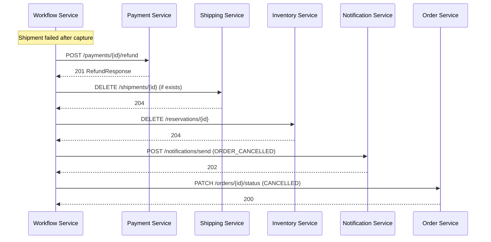
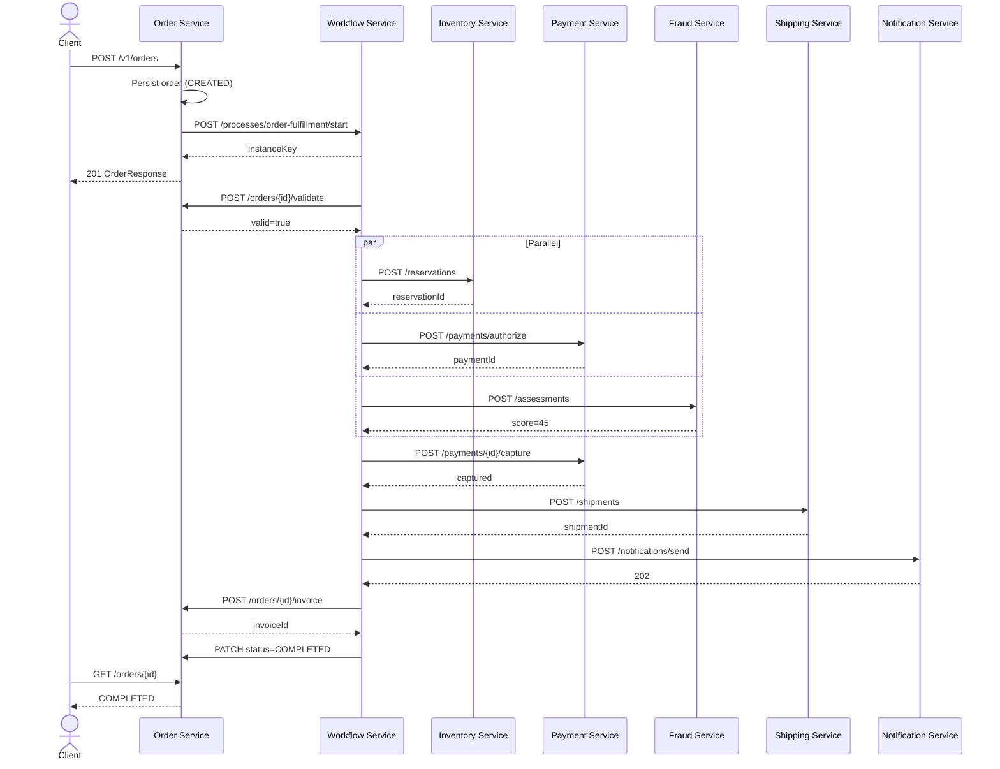
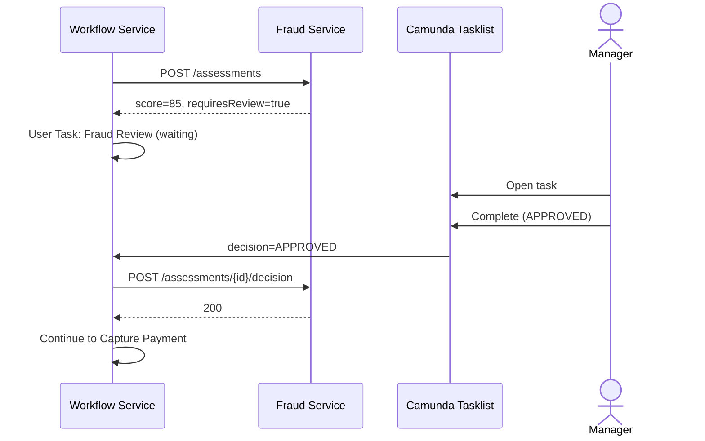

# Enterprise Order Orchestration Engine — Low-Level Design (LLD)

| Field | Value |
|---|---|
| **Version** | 1.0.0 |
| **Status** | Draft |
| **Parent** | [HLD.md](./HLD.md) |
| **Last Updated** | 2026-07-05 |

---

## Table of Contents

1. [Repository Structure](#1-repository-structure)
2. [Shared Conventions](#2-shared-conventions)
3. [Microservice API Catalog](#3-microservice-api-catalog)
4. [Workflow Service — BPMN & Job Workers](#4-workflow-service--bpmn--job-workers)
5. [Database Schemas](#5-database-schemas)
6. [Kafka Event Schemas](#6-kafka-event-schemas)
7. [Redis Key Design](#7-redis-key-design)
8. [Compensation Flow (Detailed)](#8-compensation-flow-detailed)
9. [Retry & Timer Configuration](#9-retry--timer-configuration)
10. [Human Task — Fraud Review](#10-human-task--fraud-review)
11. [OpenAPI & Code Generation](#11-openapi--code-generation)
12. [Logging Configuration (logback-spring.xml)](#12-logging-configuration-logback-springxml)
13. [Metrics & Tracing](#13-metrics--tracing)
14. [Configuration Properties](#14-configuration-properties)
15. [Sequence Diagrams](#15-sequence-diagrams)

---

## 1. Repository Structure

```
Enterprise_Order_Orchestration_Engine/
├── docs/
│   ├── HLD.md
│   └── LLD.md
├── deploy/
│   ├── docker-compose.yml
│   ├── docker-compose.observability.yml
│   ├── prometheus/prometheus.yml
│   └── grafana/dashboards/
├── shared/
│   └── order-common/                    # DTOs, error codes, trace utils
├── order-service/                       # :8081
├── inventory-service/                   # :8082
├── payment-service/                     # :8083
├── fraud-service/                       # :8084
├── shipping-service/                    # :8085
├── notification-service/                # :8086
└── workflow-service/                    # :8080
    └── src/main/resources/bpmn/
        └── order-fulfillment.bpmn
```

---

## 2. Shared Conventions

### 2.1 Standard HTTP Headers

| Header | Required | Description |
|---|---|---|
| `Authorization` | Yes (external) | `Bearer {jwt}` |
| `Idempotency-Key` | Yes (POST/PUT/PATCH mutating) | UUID v4; dedup window 24h |
| `X-Correlation-Id` | Recommended | End-to-end correlation; generated if absent |
| `X-Request-Id` | Auto | Per-hop unique ID (generated by service) |
| `traceparent` | Auto | W3C trace context (OpenTelemetry) |
| `Content-Type` | Yes | `application/json` |

### 2.2 Standard Error Response

```json
{
  "timestamp": "2026-07-05T11:30:00Z",
  "status": 409,
  "error": "CONFLICT",
  "message": "Insufficient inventory for SKU-123",
  "path": "/inventory/v1/reservations",
  "correlationId": "550e8400-e29b-41d4-a716-446655440000",
  "details": [
    { "field": "items[0].sku", "reason": "AVAILABLE_QUANTITY=0" }
  ]
}
```

### 2.3 Order Status State Machine

```
CREATED → VALIDATED → PROCESSING → PAYMENT_PENDING → FRAUD_REVIEW (optional)
       → PAID → SHIPPED → COMPLETED
       → COMPENSATING → CANCELLED / FAILED
```

---

## 3. Microservice API Catalog

Each service documents **Input APIs** (what it exposes) and **Output APIs** (what it calls). Base URLs use `${SERVICE_HOST}` placeholders.

---

### 3.1 Order Service

| Property | Value |
|---|---|
| **Port** | `8081` |
| **Base URL (local)** | `http://localhost:8081/orders` |
| **Base URL (prod)** | `https://api.order-engine.example.com/orders` |
| **OpenAPI** | `/orders/v3/api-docs` |
| **Log Config** | `order-service/src/main/resources/logback-spring.xml` |

#### Input APIs (Exposed)

| Method | Path | Description | Request Body | Response |
|---|---|---|---|---|
| `POST` | `/v1/orders` | Create order & start workflow | [CreateOrderRequest](#createorderrequest) | `201` [OrderResponse](#orderresponse) |
| `GET` | `/v1/orders/{orderId}` | Get order by ID | — | `200` OrderResponse |
| `GET` | `/v1/orders` | List orders (paginated) | Query: `status`, `page`, `size` | `200` PageOrderResponse |
| `POST` | `/v1/orders/{orderId}/validate` | Validate order (called by workflow) | — | `200` [ValidationResult](#validationresult) |
| `POST` | `/v1/orders/{orderId}/invoice` | Generate invoice (called by workflow) | [InvoiceRequest](#invoicerequest) | `201` [InvoiceResponse](#invoiceresponse) |
| `PATCH` | `/v1/orders/{orderId}/status` | Update status (internal/workflow) | [StatusUpdateRequest](#statusupdaterequest) | `200` OrderResponse |

#### Output APIs (Calls)

| Target Service | Method | URL | When |
|---|---|---|---|
| Workflow Service | `POST` | `${WORKFLOW_HOST}/workflow/v1/processes/order-fulfillment/start` | After order created |
| Kafka | Publish | `order.events` topic | On every status change |

#### Key DTOs

##### CreateOrderRequest
```json
{
  "customerId": "cust-001",
  "items": [
    { "sku": "SKU-123", "quantity": 2, "unitPrice": 29.99 }
  ],
  "shippingAddress": {
    "line1": "123 Main St",
    "city": "Seattle",
    "state": "WA",
    "postalCode": "98101",
    "country": "US"
  },
  "currency": "USD"
}
```

##### OrderResponse
```json
{
  "orderId": "ord-7f3a2b1c",
  "customerId": "cust-001",
  "status": "PROCESSING",
  "totalAmount": 59.98,
  "currency": "USD",
  "workflowInstanceKey": "2251799813685249",
  "items": [...],
  "createdAt": "2026-07-05T11:00:00Z",
  "updatedAt": "2026-07-05T11:00:05Z"
}
```

##### ValidationResult
```json
{
  "valid": true,
  "errors": []
}
```

##### InvoiceRequest / InvoiceResponse
```json
// Request
{ "orderId": "ord-7f3a2b1c", "paymentId": "pay-abc123" }

// Response
{
  "invoiceId": "inv-001",
  "orderId": "ord-7f3a2b1c",
  "pdfUrl": "https://storage.example.com/invoices/inv-001.pdf",
  "amount": 59.98,
  "issuedAt": "2026-07-05T11:15:00Z"
}
```

##### StatusUpdateRequest
```json
{
  "status": "PAID",
  "reason": "Payment captured successfully"
}
```

---

### 3.2 Inventory Service

| Property | Value |
|---|---|
| **Port** | `8082` |
| **Base URL (local)** | `http://localhost:8082/inventory` |
| **Base URL (prod)** | `https://api.order-engine.example.com/inventory` |
| **OpenAPI** | `/inventory/v3/api-docs` |
| **Log Config** | `inventory-service/src/main/resources/logback-spring.xml` |

#### Input APIs (Exposed)

| Method | Path | Description | Request | Response |
|---|---|---|---|---|
| `GET` | `/v1/inventory/{sku}` | Check stock level | — | `200` [StockResponse](#stockresponse) |
| `POST` | `/v1/reservations` | Reserve inventory | [ReserveRequest](#reserverequest) | `201` [ReservationResponse](#reservationresponse) |
| `DELETE` | `/v1/reservations/{reservationId}` | Release reservation (compensation) | — | `204` |
| `POST` | `/v1/reservations/{reservationId}/confirm` | Confirm reservation (after payment) | — | `200` ReservationResponse |

#### Output APIs (Calls)

| Target | Method | URL | When |
|---|---|---|---|
| Kafka | Publish | `inventory.events` | reservation.created / released |

##### ReserveRequest
```json
{
  "orderId": "ord-7f3a2b1c",
  "items": [
    { "sku": "SKU-123", "quantity": 2 }
  ]
}
```

##### ReservationResponse
```json
{
  "reservationId": "res-xyz789",
  "orderId": "ord-7f3a2b1c",
  "status": "RESERVED",
  "expiresAt": "2026-07-05T12:00:00Z",
  "items": [{ "sku": "SKU-123", "quantity": 2, "reserved": true }]
}
```

##### StockResponse
```json
{
  "sku": "SKU-123",
  "availableQuantity": 150,
  "reservedQuantity": 12
}
```

---

### 3.3 Payment Service

| Property | Value |
|---|---|
| **Port** | `8083` |
| **Base URL (local)** | `http://localhost:8083/payments` |
| **Base URL (prod)** | `https://api.order-engine.example.com/payments` |
| **OpenAPI** | `/payments/v3/api-docs` |
| **Log Config** | `payment-service/src/main/resources/logback-spring.xml` |

#### Input APIs (Exposed)

| Method | Path | Description | Request | Response |
|---|---|---|---|---|
| `POST` | `/v1/payments/authorize` | Authorize payment (parallel step) | [AuthorizeRequest](#authorizerequest) | `201` [PaymentResponse](#paymentresponse) |
| `POST` | `/v1/payments/{paymentId}/capture` | Capture authorized funds | [CaptureRequest](#capturerequest) | `200` PaymentResponse |
| `POST` | `/v1/payments/{paymentId}/refund` | Refund (compensation) | [RefundRequest](#refundrequest) | `201` [RefundResponse](#refundresponse) |
| `GET` | `/v1/payments/{paymentId}` | Get payment status | — | `200` PaymentResponse |

#### Output APIs (Calls)

| Target | Method | URL | When |
|---|---|---|---|
| Payment Gateway (stub) | `POST` | `${PAYMENT_GATEWAY_URL}/authorize` | During authorize |
| Payment Gateway (stub) | `POST` | `${PAYMENT_GATEWAY_URL}/capture` | During capture |
| Payment Gateway (stub) | `POST` | `${PAYMENT_GATEWAY_URL}/refund` | During refund |
| Kafka | Publish | `payment.events` | All payment state changes |

##### AuthorizeRequest
```json
{
  "orderId": "ord-7f3a2b1c",
  "customerId": "cust-001",
  "amount": 59.98,
  "currency": "USD",
  "paymentMethodToken": "pm_tok_xxxx"
}
```

##### PaymentResponse
```json
{
  "paymentId": "pay-abc123",
  "orderId": "ord-7f3a2b1c",
  "status": "AUTHORIZED",
  "authorizedAmount": 59.98,
  "capturedAmount": 0,
  "currency": "USD",
  "authorizedAt": "2026-07-05T11:01:00Z"
}
```

##### RefundRequest / RefundResponse
```json
// Request
{ "reason": "INVENTORY_FAILURE", "amount": 59.98 }

// Response
{
  "refundId": "ref-001",
  "paymentId": "pay-abc123",
  "status": "REFUNDED",
  "refundedAmount": 59.98,
  "refundedAt": "2026-07-05T11:05:00Z"
}
```

---

### 3.4 Fraud Service

| Property | Value |
|---|---|
| **Port** | `8084` |
| **Base URL (local)** | `http://localhost:8084/fraud` |
| **Base URL (prod)** | `https://api.order-engine.example.com/fraud` |
| **OpenAPI** | `/fraud/v3/api-docs` |
| **Log Config** | `fraud-service/src/main/resources/logback-spring.xml` |

#### Input APIs (Exposed)

| Method | Path | Description | Request | Response |
|---|---|---|---|---|
| `POST` | `/v1/assessments` | Run fraud check (parallel step) | [FraudAssessmentRequest](#fraudassessmentrequest) | `201` [FraudAssessmentResponse](#fraudassessmentresponse) |
| `GET` | `/v1/assessments/{assessmentId}` | Get assessment result | — | `200` FraudAssessmentResponse |
| `POST` | `/v1/assessments/{assessmentId}/decision` | Record human review decision | [ReviewDecisionRequest](#reviewdecisionrequest) | `200` FraudAssessmentResponse |

#### Output APIs (Calls)

| Target | Method | URL | When |
|---|---|---|---|
| Kafka | Publish | `fraud.events` | assessment completed / decision recorded |

##### FraudAssessmentRequest
```json
{
  "orderId": "ord-7f3a2b1c",
  "customerId": "cust-001",
  "amount": 59.98,
  "shippingAddress": { "country": "US", "postalCode": "98101" },
  "paymentMethodToken": "pm_tok_xxxx"
}
```

##### FraudAssessmentResponse
```json
{
  "assessmentId": "frd-001",
  "orderId": "ord-7f3a2b1c",
  "score": 85,
  "riskLevel": "HIGH",
  "requiresReview": true,
  "signals": ["NEW_ACCOUNT", "HIGH_VALUE_ORDER"],
  "assessedAt": "2026-07-05T11:01:30Z"
}
```

##### ReviewDecisionRequest
```json
{
  "decision": "APPROVED",
  "reviewerId": "manager-007",
  "notes": "Verified customer via phone"
}
```

---

### 3.5 Shipping Service

| Property | Value |
|---|---|
| **Port** | `8085` |
| **Base URL (local)** | `http://localhost:8085/shipping` |
| **Base URL (prod)** | `https://api.order-engine.example.com/shipping` |
| **OpenAPI** | `/shipping/v3/api-docs` |
| **Log Config** | `shipping-service/src/main/resources/logback-spring.xml` |

#### Input APIs (Exposed)

| Method | Path | Description | Request | Response |
|---|---|---|---|---|
| `POST` | `/v1/shipments` | Create shipment | [CreateShipmentRequest](#createshipmentrequest) | `201` [ShipmentResponse](#shipmentresponse) |
| `DELETE` | `/v1/shipments/{shipmentId}` | Cancel shipment (compensation) | — | `204` |
| `GET` | `/v1/shipments/{shipmentId}` | Get shipment status | — | `200` ShipmentResponse |
| `GET` | `/v1/shipments/{shipmentId}/tracking` | Tracking events | — | `200` [TrackingResponse](#trackingresponse) |

#### Output APIs (Calls)

| Target | Method | URL | When |
|---|---|---|---|
| Carrier API (stub) | `POST` | `${CARRIER_URL}/labels` | Create label |
| Carrier API (stub) | `DELETE` | `${CARRIER_URL}/labels/{id}` | Cancel |
| Kafka | Publish | `shipping.events` | shipment created / cancelled |

##### CreateShipmentRequest
```json
{
  "orderId": "ord-7f3a2b1c",
  "reservationId": "res-xyz789",
  "shippingAddress": {
    "line1": "123 Main St",
    "city": "Seattle",
    "state": "WA",
    "postalCode": "98101",
    "country": "US"
  },
  "items": [{ "sku": "SKU-123", "quantity": 2 }]
}
```

##### ShipmentResponse
```json
{
  "shipmentId": "shp-001",
  "orderId": "ord-7f3a2b1c",
  "status": "LABEL_CREATED",
  "carrier": "UPS",
  "trackingNumber": "1Z999AA10123456784",
  "labelUrl": "https://carrier.example.com/labels/shp-001.pdf",
  "createdAt": "2026-07-05T11:10:00Z"
}
```

---

### 3.6 Notification Service

| Property | Value |
|---|---|
| **Port** | `8086` |
| **Base URL (local)** | `http://localhost:8086/notifications` |
| **Base URL (prod)** | `https://api.order-engine.example.com/notifications` |
| **OpenAPI** | `/notifications/v3/api-docs` |
| **Log Config** | `notification-service/src/main/resources/logback-spring.xml` |

#### Input APIs (Exposed)

| Method | Path | Description | Request | Response |
|---|---|---|---|---|
| `POST` | `/v1/notifications/send` | Send notification | [SendNotificationRequest](#sendnotificationrequest) | `202` [NotificationResponse](#notificationresponse) |
| `GET` | `/v1/notifications/{notificationId}` | Get delivery status | — | `200` NotificationResponse |

#### Output APIs (Calls)

| Target | Method | URL | When |
|---|---|---|---|
| Email/SMS Provider (stub) | `POST` | `${NOTIFY_PROVIDER_URL}/send` | Async delivery |
| Kafka | Publish | `notification.events` | sent / failed |

##### SendNotificationRequest
```json
{
  "orderId": "ord-7f3a2b1c",
  "customerId": "cust-001",
  "channel": "EMAIL",
  "template": "ORDER_SHIPPED",
  "variables": {
    "trackingNumber": "1Z999AA10123456784",
    "orderTotal": "59.98"
  }
}
```

##### NotificationResponse
```json
{
  "notificationId": "ntf-001",
  "status": "QUEUED",
  "channel": "EMAIL",
  "recipient": "c***@example.com",
  "queuedAt": "2026-07-05T11:12:00Z"
}
```

---

### 3.7 Workflow Service

| Property | Value |
|---|---|
| **Port** | `8080` |
| **Base URL (local)** | `http://localhost:8080/workflow` |
| **Base URL (prod)** | `https://api.order-engine.example.com/workflow` |
| **OpenAPI** | `/workflow/v3/api-docs` |
| **Log Config** | `workflow-service/src/main/resources/logback-spring.xml` |
| **Zeebe Gateway** | `localhost:26500` (gRPC) |

#### Input APIs (Exposed)

| Method | Path | Description | Request | Response |
|---|---|---|---|---|
| `POST` | `/v1/processes/order-fulfillment/start` | Start order workflow | [StartWorkflowRequest](#startworkflowrequest) | `201` [WorkflowInstanceResponse](#workflowinstanceresponse) |
| `GET` | `/v1/instances/{instanceKey}` | Get workflow instance status | — | `200` WorkflowInstanceResponse |
| `POST` | `/v1/instances/{instanceKey}/cancel` | Cancel workflow (admin) | [CancelRequest](#cancelrequest) | `200` |

#### Output APIs (Calls) — Job Worker Invocations

| Target Service | Method | URL | Job Type (Zeebe) |
|---|---|---|---|
| Order Service | `POST` | `${ORDER_HOST}/orders/v1/orders/{orderId}/validate` | `validate-order` |
| Inventory Service | `POST` | `${INVENTORY_HOST}/inventory/v1/reservations` | `reserve-inventory` |
| Inventory Service | `DELETE` | `${INVENTORY_HOST}/inventory/v1/reservations/{reservationId}` | `release-inventory` |
| Payment Service | `POST` | `${PAYMENT_HOST}/payments/v1/payments/authorize` | `authorize-payment` |
| Payment Service | `POST` | `${PAYMENT_HOST}/payments/v1/payments/{paymentId}/capture` | `capture-payment` |
| Payment Service | `POST` | `${PAYMENT_HOST}/payments/v1/payments/{paymentId}/refund` | `refund-payment` |
| Fraud Service | `POST` | `${FRAUD_HOST}/fraud/v1/assessments` | `fraud-check` |
| Shipping Service | `POST` | `${SHIPPING_HOST}/shipping/v1/shipments` | `create-shipment` |
| Shipping Service | `DELETE` | `${SHIPPING_HOST}/shipping/v1/shipments/{shipmentId}` | `cancel-shipment` |
| Notification Service | `POST` | `${NOTIFICATION_HOST}/notifications/v1/notifications/send` | `send-notification` |
| Order Service | `POST` | `${ORDER_HOST}/orders/v1/orders/{orderId}/invoice` | `generate-invoice` |
| Order Service | `PATCH` | `${ORDER_HOST}/orders/v1/orders/{orderId}/status` | `update-order-status` |

##### StartWorkflowRequest
```json
{
  "orderId": "ord-7f3a2b1c",
  "customerId": "cust-001",
  "totalAmount": 59.98,
  "currency": "USD",
  "items": [{ "sku": "SKU-123", "quantity": 2, "unitPrice": 29.99 }],
  "shippingAddress": { "line1": "123 Main St", "city": "Seattle", "state": "WA", "postalCode": "98101", "country": "US" },
  "paymentMethodToken": "pm_tok_xxxx"
}
```

##### WorkflowInstanceResponse
```json
{
  "instanceKey": "2251799813685249",
  "processDefinitionKey": "order-fulfillment",
  "orderId": "ord-7f3a2b1c",
  "status": "ACTIVE",
  "currentStage": "PARALLEL_FULFILLMENT",
  "startedAt": "2026-07-05T11:00:05Z"
}
```

---

## 4. Workflow Service — BPMN & Job Workers

### 4.1 Process Definition

| Property | Value |
|---|---|
| **Process ID** | `order-fulfillment` |
| **Version** | `1` (auto-increment on deploy) |
| **File** | `workflow-service/src/main/resources/bpmn/order-fulfillment.bpmn` |

### 4.2 Process Variables

| Variable | Type | Set By | Description |
|---|---|---|---|
| `orderId` | String | Start event | Business key |
| `customerId` | String | Start event | Customer reference |
| `totalAmount` | Double | Start event | Order total |
| `currency` | String | Start event | ISO 4217 |
| `items` | JSON | Start event | Line items array |
| `shippingAddress` | JSON | Start event | Delivery address |
| `paymentMethodToken` | String | Start event | Tokenized payment method |
| `reservationId` | String | reserve-inventory worker | Set on success |
| `paymentId` | String | authorize-payment worker | Set on success |
| `fraudScore` | Integer | fraud-check worker | 0–100 |
| `requiresFraudReview` | Boolean | fraud-check worker | score > 80 |
| `shipmentId` | String | create-shipment worker | Set on success |
| `compensationReason` | String | Error events | Audit trail |

### 4.3 Job Worker Registry

| Job Type | Max Jobs Active | Timeout | Retries | Backoff |
|---|---|---|---|---|
| `validate-order` | 32 | 30s | 3 | 5s |
| `reserve-inventory` | 32 | 30s | 3 | 5s |
| `authorize-payment` | 32 | 60s | 3 | 10s |
| `fraud-check` | 32 | 30s | 3 | 5s |
| `capture-payment` | 32 | 60s | 3 | 10s |
| `create-shipment` | 16 | 45s | **3** | **30s** |
| `send-notification` | 64 | 15s | 5 | 5s |
| `generate-invoice` | 16 | 30s | 3 | 5s |
| `refund-payment` | 16 | 60s | 5 | 10s |
| `cancel-shipment` | 16 | 30s | 5 | 10s |
| `release-inventory` | 32 | 30s | 5 | 5s |
| `update-order-status` | 32 | 15s | 3 | 5s |

### 4.4 BPMN Element IDs (for Operate screenshots)

| Element ID | Type | Label |
|---|---|---|
| `StartEvent_OrderReceived` | Start Event | Order Received |
| `Task_ValidateOrder` | Service Task | Validate Order |
| `Gateway_ValidCheck` | Exclusive Gateway | Valid? |
| `Gateway_ParallelFork` | Parallel Gateway | Fork |
| `Task_ReserveInventory` | Service Task | Reserve Inventory |
| `Task_AuthorizePayment` | Service Task | Authorize Payment |
| `Task_FraudCheck` | Service Task | Fraud Check |
| `Gateway_ParallelJoin` | Parallel Gateway | Join |
| `Gateway_FraudScore` | Exclusive Gateway | Score > 80? |
| `Task_FraudReview` | User Task | Manager Review |
| `Task_CapturePayment` | Service Task | Capture Payment |
| `Task_CreateShipment` | Service Task | Create Shipment |
| `Task_SendNotification` | Service Task | Send Notification |
| `Task_GenerateInvoice` | Service Task | Generate Invoice |
| `EndEvent_Complete` | End Event | Complete |
| `Timer_PaymentTimeout` | Boundary Timer | PT15M |
| `SubProcess_Compensation` | Event Subprocess | Compensation |
| `Task_RefundPayment` | Service Task | Refund Payment |
| `Task_CancelShipment` | Service Task | Cancel Shipment |
| `Task_NotifyFailure` | Service Task | Notify User |
| `EndEvent_Cancelled` | End Event | Order Cancelled |

---

## 5. Database Schemas

Each service uses schema `{service_name}` in its own PostgreSQL database (or separate DB instance in prod).

### 5.1 Order Service — `order_db`

```sql
CREATE TABLE orders (
    order_id        VARCHAR(36) PRIMARY KEY,
    customer_id     VARCHAR(36) NOT NULL,
    status          VARCHAR(32) NOT NULL,
    total_amount    DECIMAL(12,2) NOT NULL,
    currency        CHAR(3) NOT NULL DEFAULT 'USD',
    workflow_key    VARCHAR(64),
    shipping_address JSONB NOT NULL,
    created_at      TIMESTAMPTZ NOT NULL DEFAULT NOW(),
    updated_at      TIMESTAMPTZ NOT NULL DEFAULT NOW()
);
CREATE INDEX idx_orders_customer ON orders(customer_id);
CREATE INDEX idx_orders_status ON orders(status);

CREATE TABLE order_items (
    id          BIGSERIAL PRIMARY KEY,
    order_id    VARCHAR(36) NOT NULL REFERENCES orders(order_id),
    sku         VARCHAR(64) NOT NULL,
    quantity    INT NOT NULL CHECK (quantity > 0),
    unit_price  DECIMAL(12,2) NOT NULL
);

CREATE TABLE order_events (
    id          BIGSERIAL PRIMARY KEY,
    order_id    VARCHAR(36) NOT NULL,
    event_type  VARCHAR(64) NOT NULL,
    payload     JSONB,
    created_at  TIMESTAMPTZ NOT NULL DEFAULT NOW()
);

CREATE TABLE invoices (
    invoice_id  VARCHAR(36) PRIMARY KEY,
    order_id    VARCHAR(36) NOT NULL REFERENCES orders(order_id),
    payment_id  VARCHAR(36) NOT NULL,
    amount      DECIMAL(12,2) NOT NULL,
    pdf_url     VARCHAR(512),
    issued_at   TIMESTAMPTZ NOT NULL DEFAULT NOW()
);
```

### 5.2 Inventory Service — `inventory_db`

```sql
CREATE TABLE inventory (
    sku                 VARCHAR(64) PRIMARY KEY,
    available_quantity  INT NOT NULL DEFAULT 0 CHECK (available_quantity >= 0),
    reserved_quantity   INT NOT NULL DEFAULT 0 CHECK (reserved_quantity >= 0),
    updated_at          TIMESTAMPTZ NOT NULL DEFAULT NOW()
);

CREATE TABLE reservations (
    reservation_id  VARCHAR(36) PRIMARY KEY,
    order_id        VARCHAR(36) NOT NULL UNIQUE,
    status          VARCHAR(32) NOT NULL,  -- RESERVED, CONFIRMED, RELEASED
    expires_at      TIMESTAMPTZ NOT NULL,
    created_at      TIMESTAMPTZ NOT NULL DEFAULT NOW()
);

CREATE TABLE reservation_items (
    id              BIGSERIAL PRIMARY KEY,
    reservation_id  VARCHAR(36) NOT NULL REFERENCES reservations(reservation_id),
    sku             VARCHAR(64) NOT NULL,
    quantity        INT NOT NULL
);
```

### 5.3 Payment Service — `payment_db`

```sql
CREATE TABLE payments (
    payment_id          VARCHAR(36) PRIMARY KEY,
    order_id            VARCHAR(36) NOT NULL,
    status              VARCHAR(32) NOT NULL,
    authorized_amount   DECIMAL(12,2),
    captured_amount     DECIMAL(12,2) DEFAULT 0,
    currency            CHAR(3) NOT NULL,
    gateway_ref         VARCHAR(128),
    authorized_at       TIMESTAMPTZ,
    captured_at         TIMESTAMPTZ,
    created_at          TIMESTAMPTZ NOT NULL DEFAULT NOW()
);

CREATE TABLE refunds (
    refund_id       VARCHAR(36) PRIMARY KEY,
    payment_id      VARCHAR(36) NOT NULL REFERENCES payments(payment_id),
    amount          DECIMAL(12,2) NOT NULL,
    reason          VARCHAR(128),
    status          VARCHAR(32) NOT NULL,
    refunded_at     TIMESTAMPTZ NOT NULL DEFAULT NOW()
);
```

### 5.4 Fraud Service — `fraud_db`

```sql
CREATE TABLE fraud_assessments (
    assessment_id   VARCHAR(36) PRIMARY KEY,
    order_id        VARCHAR(36) NOT NULL,
    score           INT NOT NULL CHECK (score BETWEEN 0 AND 100),
    risk_level      VARCHAR(16) NOT NULL,
    requires_review BOOLEAN NOT NULL DEFAULT FALSE,
    signals         JSONB,
    assessed_at     TIMESTAMPTZ NOT NULL DEFAULT NOW()
);

CREATE TABLE review_decisions (
    id              BIGSERIAL PRIMARY KEY,
    assessment_id   VARCHAR(36) NOT NULL REFERENCES fraud_assessments(assessment_id),
    decision        VARCHAR(16) NOT NULL,  -- APPROVED, REJECTED
    reviewer_id     VARCHAR(36) NOT NULL,
    notes           TEXT,
    decided_at      TIMESTAMPTZ NOT NULL DEFAULT NOW()
);
```

### 5.5 Shipping Service — `shipping_db`

```sql
CREATE TABLE shipments (
    shipment_id     VARCHAR(36) PRIMARY KEY,
    order_id        VARCHAR(36) NOT NULL,
    reservation_id  VARCHAR(36),
    status          VARCHAR(32) NOT NULL,
    carrier         VARCHAR(32),
    tracking_number VARCHAR(64),
    label_url       VARCHAR(512),
    created_at      TIMESTAMPTZ NOT NULL DEFAULT NOW(),
    cancelled_at    TIMESTAMPTZ
);
```

### 5.6 Notification Service — `notification_db`

```sql
CREATE TABLE notifications (
    notification_id VARCHAR(36) PRIMARY KEY,
    order_id        VARCHAR(36),
    customer_id     VARCHAR(36) NOT NULL,
    channel         VARCHAR(16) NOT NULL,
    template        VARCHAR(64) NOT NULL,
    status          VARCHAR(16) NOT NULL,
    recipient       VARCHAR(256),
    variables       JSONB,
    queued_at       TIMESTAMPTZ NOT NULL DEFAULT NOW(),
    sent_at         TIMESTAMPTZ
);
```

---

## 6. Kafka Event Schemas

All events share an envelope:

```json
{
  "eventId": "evt-uuid",
  "eventType": "order.created",
  "timestamp": "2026-07-05T11:00:00Z",
  "correlationId": "550e8400-e29b-41d4-a716-446655440000",
  "source": "order-service",
  "data": { }
}
```

### 6.1 Topic Configuration

| Topic | Partitions | Replication | Key | Retention |
|---|---|---|---|---|
| `order.events` | 12 | 3 | `orderId` | 7d |
| `inventory.events` | 6 | 3 | `orderId` | 7d |
| `payment.events` | 6 | 3 | `orderId` | 30d |
| `fraud.events` | 3 | 3 | `orderId` | 30d |
| `shipping.events` | 6 | 3 | `orderId` | 7d |
| `notification.events` | 3 | 3 | `orderId` | 3d |

### 6.2 Event Types

| Topic | eventType | Producer |
|---|---|---|
| `order.events` | `order.created`, `order.validated`, `order.completed`, `order.cancelled` | Order Service |
| `inventory.events` | `inventory.reserved`, `inventory.released`, `inventory.confirmed` | Inventory Service |
| `payment.events` | `payment.authorized`, `payment.captured`, `payment.refunded`, `payment.timeout` | Payment Service |
| `fraud.events` | `fraud.assessed`, `fraud.review_required`, `fraud.decision` | Fraud Service |
| `shipping.events` | `shipment.created`, `shipment.cancelled` | Shipping Service |
| `notification.events` | `notification.sent`, `notification.failed` | Notification Service |

---

## 7. Redis Key Design

```
# Idempotency (all services)
{service}:idempotency:{idempotencyKey}  →  serialized response JSON  TTL 86400s

# Inventory pessimistic lock
inventory:lock:{sku}  →  {orderId}  TTL 300s

# Fraud score cache
fraud:score:{customerId}  →  {score, assessedAt}  TTL 3600s

# Rate limiting (gateway or service)
ratelimit:{clientId}:{endpoint}  →  counter  TTL 60s

# Workflow dedup (prevent double start)
workflow:started:{orderId}  →  {instanceKey}  TTL 86400s
```

---

## 8. Compensation Flow (Detailed)

### 8.1 Trigger Conditions

| Scenario | Trigger | Compensation Steps |
|---|---|---|
| Inventory fails after payment authorized | `reserve-inventory` BPMN error | Release nothing → cancel auth (void) |
| Payment capture fails | `capture-payment` error | Release inventory |
| Shipment fails (retries exhausted) | `create-shipment` error after capture | Refund → cancel shipment (if partial) → release inventory |
| Fraud rejected (human) | User task outcome = REJECTED | Void auth → release inventory |
| Payment timeout (15 min) | Boundary timer | Void auth → release inventory → notify |

### 8.2 Compensation Sequence



### 8.3 Idempotent Compensation

Each compensation API checks current state before acting:
- Refund: skip if already `REFUNDED`
- Cancel shipment: skip if already `CANCELLED`
- Release inventory: skip if already `RELEASED`

---

## 9. Retry & Timer Configuration

### 9.1 Shipping Retry (Zeebe Job Worker)

```yaml
# workflow-service application.yml
zeebe:
  client:
    job:
      timeouts:
        create-shipment: 45s
      poll-interval: 100ms
```

Job worker annotation (conceptual):

```java
@JobWorker(type = "create-shipment", maxJobsActive = 16)
public void createShipment(ActivatedJob job) {
    // On failure: throw BpmnError or rethrow to trigger Zeebe retry
    // retries=3, backoff=30s configured in BPMN service task extension
}
```

BPMN service task extension:

```xml
<zeebe:taskDefinition type="create-shipment" retries="3" />
<zeebe:taskHeaders>
  <zeebe:header key="retryBackoff" value="PT30S" />
</zeebe:taskHeaders>
```

### 9.2 Payment Timeout Timer

```xml
<bpmn:boundaryEvent id="Timer_PaymentTimeout" attachedToRef="Task_AuthorizePayment">
  <bpmn:timerEventDefinition>
    <bpmn:timeDuration>PT15M</bpmn:timeDuration>
  </bpmn:timerEventDefinition>
</bpmn:boundaryEvent>
```

On fire → escalate to `SubProcess_Compensation` with `compensationReason=PAYMENT_TIMEOUT`.

---

## 10. Human Task — Fraud Review

### 10.1 User Task Configuration

| Property | Value |
|---|---|
| Task ID | `Task_FraudReview` |
| Assignee | — (group assignment) |
| Candidate Groups | `fraud-managers` |
| Form Key | `fraud-review-form` |
| Due Date | PT24H (escalation) |

### 10.2 Form Fields (Camunda Form)

| Field | Type | Description |
|---|---|---|
| `orderId` | text (readonly) | Order reference |
| `fraudScore` | number (readonly) | Risk score |
| `signals` | text (readonly) | Risk signals |
| `decision` | select | APPROVED / REJECTED |
| `notes` | text | Reviewer notes |

### 10.3 Integration Flow

1. Workflow reaches User Task → instance visible in **Tasklist**
2. Manager completes task with `decision` variable
3. Workflow Service job worker (or Zeebe message) calls Fraud Service to persist decision
4. Exclusive gateway routes to capture or compensation

---

## 11. OpenAPI & Code Generation

Each service exposes OpenAPI 3.1 at `/v3/api-docs`. Workflow Service generates REST clients via **OpenAPI Generator** (`spring-cloud-starter-openfeign` or `WebClient`).

```
workflow-service/
  src/main/resources/openapi/
    order-api.yaml
    inventory-api.yaml
    payment-api.yaml
    fraud-api.yaml
    shipping-api.yaml
    notification-api.yaml
```

Maven plugin (parent POM):

```xml
<plugin>
  <groupId>org.openapitools</groupId>
  <artifactId>openapi-generator-maven-plugin</artifactId>
  <configuration>
    <generatorName>spring</generatorName>
    <library>spring-boot</library>
    <configOptions>
      <useSpringBoot3>true</useSpringBoot3>
      <interfaceOnly>true</interfaceOnly>
    </configOptions>
  </configuration>
</plugin>
```

---

## 12. Logging Configuration (logback-spring.xml)

Every microservice uses **structured JSON logging** in prod and readable console logging locally. Pattern includes correlation ID, trace ID, service name, and API endpoint.

### 12.1 Shared Log Fields (MDC)

| MDC Key | Source | Example |
|---|---|---|
| `service` | Static per service | `order-service` |
| `correlationId` | `X-Correlation-Id` header | `550e8400-...` |
| `traceId` | OpenTelemetry | `abc123def456` |
| `spanId` | OpenTelemetry | `789ghi` |
| `orderId` | Extracted from path/body | `ord-7f3a2b1c` |
| `httpMethod` | Request | `POST` |
| `httpPath` | Request | `/v1/orders` |
| `httpStatus` | Response | `201` |
| `durationMs` | Filter | `45` |

### 12.2 Order Service — `logback-spring.xml`

```xml
<?xml version="1.0" encoding="UTF-8"?>
<configuration scan="true" scanPeriod="30 seconds">

    <springProperty scope="context" name="APP_NAME" source="spring.application.name" defaultValue="order-service"/>

    <!-- Local/dev: human-readable -->
    <springProfile name="local,dev">
        <appender name="CONSOLE" class="ch.qos.logback.core.ConsoleAppender">
            <encoder>
                <pattern>%d{ISO8601} [%thread] %-5level ${APP_NAME} [%X{correlationId:-}] [%X{traceId:-}] %logger{36} - %msg %n</pattern>
            </encoder>
        </appender>
        <root level="INFO">
            <appender-ref ref="CONSOLE"/>
        </root>
        <logger name="com.orderengine.order" level="DEBUG"/>
    </springProfile>

    <!-- Prod/staging: JSON for Loki/ELK -->
    <springProfile name="prod,staging">
        <appender name="JSON" class="ch.qos.logback.core.ConsoleAppender">
            <encoder class="net.logstash.logback.encoder.LoggingEventCompositeJsonEncoder">
                <providers>
                    <timestamp><timeZone>UTC</timeZone></timestamp>
                    <logLevel/>
                    <loggerName/>
                    <mdc/>
                    <message/>
                    <stackTrace/>
                    <pattern>
                        <pattern>
                            {
                              "service": "${APP_NAME}",
                              "environment": "${SPRING_PROFILES_ACTIVE:-unknown}"
                            }
                        </pattern>
                    </pattern>
                </providers>
            </encoder>
        </appender>
        <root level="INFO">
            <appender-ref ref="JSON"/>
        </root>
        <logger name="com.orderengine.order" level="INFO"/>
    </springProfile>

    <!-- API access log -->
    <logger name="com.orderengine.order.filter.ApiAccessLogFilter" level="INFO" additivity="false">
        <springProfile name="local,dev">
            <appender-ref ref="CONSOLE"/>
        </springProfile>
        <springProfile name="prod,staging">
            <appender-ref ref="JSON"/>
        </springProfile>
    </logger>

</configuration>
```

### 12.3 Per-Service Log Config Paths

| Service | Log Config File | Logger Package Root |
|---|---|---|
| Order Service | `order-service/src/main/resources/logback-spring.xml` | `com.orderengine.order` |
| Inventory Service | `inventory-service/src/main/resources/logback-spring.xml` | `com.orderengine.inventory` |
| Payment Service | `payment-service/src/main/resources/logback-spring.xml` | `com.orderengine.payment` |
| Fraud Service | `fraud-service/src/main/resources/logback-spring.xml` | `com.orderengine.fraud` |
| Shipping Service | `shipping-service/src/main/resources/logback-spring.xml` | `com.orderengine.shipping` |
| Notification Service | `notification-service/src/main/resources/logback-spring.xml` | `com.orderengine.notification` |
| Workflow Service | `workflow-service/src/main/resources/logback-spring.xml` | `com.orderengine.workflow` |

> All services share the same template; only `APP_NAME` and logger package differ. Copy the Order Service template and replace package names.

### 12.4 API Access Log Filter (all services)

Each service implements `ApiAccessLogFilter` that logs on every request/response:

```
INFO  order-service [corr=550e8400] [trace=abc123] API IN  POST /v1/orders customerId=cust-001
INFO  order-service [corr=550e8400] [trace=abc123] API OUT POST /v1/orders status=201 durationMs=45 orderId=ord-7f3a2b1c
```

Workflow job workers log similarly:

```
INFO  workflow-service [corr=550e8400] JOB IN  create-shipment orderId=ord-7f3a2b1c attempt=2
INFO  workflow-service [corr=550e8400] JOB OUT create-shipment status=SUCCESS durationMs=1200 shipmentId=shp-001
```

### 12.5 PII Masking

```xml
<!-- In prod profile, add replace provider -->
<replace>
    <regex>"paymentMethodToken"\s*:\s*"[^"]*"</regex>
    <replacement>"paymentMethodToken":"***MASKED***"</replacement>
</replace>
```

---

## 13. Metrics & Tracing

### 13.1 Micrometer Metrics (per service)

| Metric | Type | Tags |
|---|---|---|
| `http.server.requests` | Timer | `method`, `uri`, `status`, `service` |
| `order.created.total` | Counter | `service=order-service` |
| `inventory.reservation.failed.total` | Counter | `reason` |
| `payment.refund.total` | Counter | `reason` |
| `fraud.review.required.total` | Counter | — |
| `workflow.job.duration` | Timer | `jobType`, `status` |
| `workflow.compensation.triggered.total` | Counter | `reason` |

### 13.2 Prometheus Scrape Config

```yaml
# deploy/prometheus/prometheus.yml
scrape_configs:
  - job_name: order-engine
    metrics_path: /actuator/prometheus
    static_configs:
      - targets:
          - order-service:8081
          - inventory-service:8082
          - payment-service:8083
          - fraud-service:8084
          - shipping-service:8085
          - notification-service:8086
          - workflow-service:8080
```

### 13.3 Trace Propagation

Spring Boot 3 with `micrometer-tracing-bridge-otel`. All outbound `WebClient`/Feign calls inject `traceparent`. Kafka producers inject trace context in headers.

---

## 14. Configuration Properties

### 14.1 Environment Variable Matrix

| Variable | Used By | Example (local) |
|---|---|---|
| `ORDER_HOST` | Workflow | `http://localhost:8081/orders` |
| `INVENTORY_HOST` | Workflow | `http://localhost:8082/inventory` |
| `PAYMENT_HOST` | Workflow | `http://localhost:8083/payments` |
| `FRAUD_HOST` | Workflow | `http://localhost:8084/fraud` |
| `SHIPPING_HOST` | Workflow | `http://localhost:8085/shipping` |
| `NOTIFICATION_HOST` | Workflow | `http://localhost:8086/notifications` |
| `WORKFLOW_HOST` | Order | `http://localhost:8080/workflow` |
| `ZEEBE_GATEWAY` | Workflow | `localhost:26500` |
| `KAFKA_BOOTSTRAP` | All | `localhost:9092` |
| `REDIS_HOST` | All | `localhost:6379` |
| `POSTGRES_URL` | Per service | `jdbc:postgresql://localhost:5432/order_db` |
| `SPRING_PROFILES_ACTIVE` | All | `local` |

### 14.2 Workflow Service — Full `application.yml` (excerpt)

```yaml
spring:
  application:
    name: workflow-service

server:
  port: 8080
  servlet:
    context-path: /workflow

zeebe:
  client:
    broker:
      gateway-address: ${ZEEBE_GATEWAY:localhost:26500}
    security:
      plaintext: true

services:
  order:
    base-url: ${ORDER_HOST:http://localhost:8081/orders}
  inventory:
    base-url: ${INVENTORY_HOST:http://localhost:8082/inventory}
  payment:
    base-url: ${PAYMENT_HOST:http://localhost:8083/payments}
  fraud:
    base-url: ${FRAUD_HOST:http://localhost:8084/fraud}
  shipping:
    base-url: ${SHIPPING_HOST:http://localhost:8085/shipping}
  notification:
    base-url: ${NOTIFICATION_HOST:http://localhost:8086/notifications}

management:
  endpoints:
    web:
      exposure:
        include: health,info,prometheus,metrics
  metrics:
    tags:
      application: ${spring.application.name}
```

---

## 15. Sequence Diagrams

### 15.1 Happy Path



### 15.2 Fraud Human Task Path



---

## Appendix A — Service Dependency Matrix

|  | Order | Inventory | Payment | Fraud | Shipping | Notification | Workflow |
|---|---|---|---|---|---|---|---|
| **Order** | — | — | — | — | — | — | ✓ start |
| **Inventory** | — | — | — | — | — | — | — |
| **Payment** | — | — | — | — | — | — | — |
| **Fraud** | — | — | — | — | — | — | — |
| **Shipping** | — | — | — | — | — | — | — |
| **Notification** | — | — | — | — | — | — | — |
| **Workflow** | ✓ | ✓ | ✓ | ✓ | ✓ | ✓ | Zeebe |

---

## Appendix B — HTTP Status Code Conventions

| Code | Usage |
|---|---|
| `201` | Resource created (order, payment, reservation) |
| `202` | Accepted async (notification queued) |
| `204` | Successful delete (release, cancel) |
| `400` | Validation error |
| `404` | Resource not found |
| `409` | Business conflict (out of stock, duplicate) |
| `422` | Unprocessable (fraud rejected) |
| `503` | Dependency unavailable (retry by Zeebe) |

---

## Appendix C — Next Implementation Steps

1. Scaffold Maven multi-module parent POM
2. Implement shared `order-common` (DTOs, filters, MDC utils)
3. Deploy Camunda 8 via Docker Compose
4. Author `order-fulfillment.bpmn` in Camunda Modeler
5. Implement services in order: Order → Inventory → Payment → Fraud → Shipping → Notification → Workflow
6. Add Testcontainers integration tests for happy path + compensation
7. Grafana dashboards + BPMN screenshot for README
